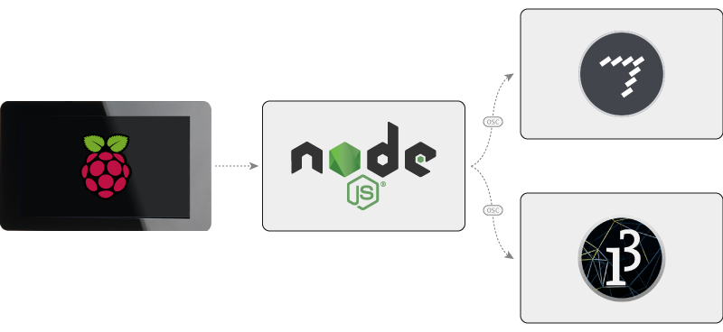

# NodeJS Server and OSC Service



The intent of this project is to use the Pi with a screen. From that screen, the user can interact with the UI to send OSC messages via a Node JS server.


## Technical Requirements

- A [Raspberry Pi](https://www.raspberrypi.org/)
- [Max](https://cycling74.com/products/max/). While the receiving application is built in Max, but really any software that receives OSC messages can do the trick.


## Setting Up the Raspberry Pi

These steps take into account that the Pi is brand new out of the box.

1. Install [Raspbian](https://www.raspberrypi.org/downloads/) on the Pi

2. Install [Node](https://nodejs.org/) on the Pi (the version that comes with the Pi is out of date)

    ```
    curl -sL https://deb.nodesource.com/setup_7.x | sudo -E bash -
    sudo apt-get install -y nodejs
    ```

3. Download master branch `.zip` from the repository

4. Unzip the downloaded file

5. Copy directories:

    a. Node server: `/home/pi/Downloads/test-node-js-and-osc-master/src/node/` to `/var/www/osc-api/node/`
    
    b. Web UI: `/home/pi/Downloads/test-node-js-and-osc-master/src/web/www/` to `/var/www/osc-api/www/`

6. Go to `/var/www/osc-api/node/` to install the Node module dependencies

    a. Fix the issue with the `serialport` Node module  
       When installing the `osc` Node module, [there is an issue](https://github.com/EmergingTechnologyAdvisors/node-serialport/issues/649) with `serialport`. Here are the steps to fix the issue:

		1. Install `node-gyp`

				sudo npm install -g node-gyp

    
		2. Install `serialport`

				sudo npm install --unsafe-perm serialport --build-from-source


    b. Install the remaining Node modules dependencies
    
		sudo npm install


7. Create an `.env` file in `/var/www/osc-api/node/`  
See the instructions in the [Node server read me file](./src/node/README.md).

8. Install [Nginx](https://nginx.org/en/)

		sudo apt-get install nginx


9. Setup Nginx

    a. Copy `/var/www/osc-api/node/nginx-setup/osc-api` to `/etc/nginx/sites-available/`

    b. Delete `default` from `/etc/nginx/sites-enabled/`
    
    c. Create a symlink of `osc-api`
    
			sudo ln -s /etc/nginx/sites-available/osc-api /etc/nginx/sites-enabled/


## Running the Different Components

Once all the components are set up on the Pi, it's now possible to run all the projects:

0. Open the Max patch from a computer on the same network as the Pi
0. Start the Nginx server
0. Start the Node service
0. Open a browser on the Pi at [http://localhost/](http://localhost/)

Once all of these are running, using the buttons will send OSC messages from the Pi to the Max patch.


## Contributing

See details on how to work the part of the project which you need:

- [Max Application](./src/max/README.md)
- [Node Server](./src/node/README.md)
- [Web UI](./src/web/README.md)